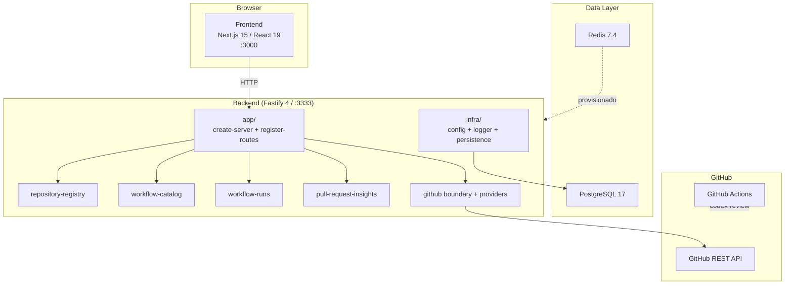

# ForgeOps - Arquitetura Atual

> Atualizado em: 2026-07-03

---

## Visao Geral

ForgeOps e uma plataforma de governanca de automacoes de engenharia. O repositorio segue uma arquitetura de monorepo com `pnpm workspaces` e `Turborepo`, dividido em duas aplicacoes principais (`frontend` e `backend`), dois pacotes de produto (`@forgeops/core` com o motor puro do framework e `@forgeops/cli` para distribuicao standalone via NPM) e dois pacotes compartilhados de configuracao (`eslint-config` e `tsconfig`).

Hoje o codebase ja cobre:

- registro de repositorios monitorados
- catalogo de workflows
- persistencia, sync e leitura de workflow runs e jobs
- pull requests com detalhe enriquecido (review summary + workflow runs vinculadas)
- automacao advisory de review com Codex no GitHub Actions
- review intelligence baseline (summaries do Codex persistidos e agregados por repositorio)
- policy engine com avaliacao persistida de padroes minimos por repositorio
- automation health score (0-100) calculado sob demanda por repositorio
- trilha de auditoria de sincronizacoes (sync events)
- dashboard de automation health no frontend
- distribuicao standalone: CLI `forgeops` (init, score, dashboard local) e composite action `forgeops-review` com gatilho por comentario `@forgeops review`

---

## Estrutura do Monorepo

```text
forge-ops/
|-- frontend/                   # Aplicacao web (Next.js 15 + React 19)
|-- backend/                    # API REST (Fastify 4 + TypeScript strict)
|-- packages/
|   |-- core/                   # Motor puro: sinais, score e scanner local (@forgeops/core)
|   |-- cli/                    # CLI forgeops: init, score, dashboard local (@forgeops/cli)
|   |-- eslint-config/          # Configuracao ESLint compartilhada
|   `-- tsconfig/               # Configuracao TypeScript base compartilhada
|-- docs/
|   |-- adr/                    # Architecture Decision Records
|   |-- architecture/           # Documentacao arquitetural
|   |-- guides/                 # Guias operacionais
|   |-- plans/                  # Planos de feature ativos
|   `-- workflows/              # Documentacao de workflows do repo
|-- .github/
|   |-- prompts/                # Prompts versionados do Codex Review
|   |-- workflows/              # GitHub Actions CI
|   `-- ISSUE_TEMPLATE/         # Templates de issue
|-- scripts/                    # Scripts utilitarios do workspace
|-- docker-compose.yml          # Stack local com Traefik, frontend, backend, PostgreSQL e Redis
|-- turbo.json                  # Pipeline Turborepo
|-- pnpm-workspace.yaml
|-- package.json                # Root workspace
|-- AGENTS.md                   # Regras operacionais do agente
`-- PROJECT.md                  # Blueprint do produto
```

> Observacao: `packages/ui`, `packages/types` e `packages/config` ainda nao foram criados. O repositório continua seguindo o ADR de manter shared runtime packages no minimo necessario.

---

## Stack Implementado

### Backend

| Camada         | Tecnologia               |
| -------------- | ------------------------ |
| Runtime        | Node.js ESM              |
| Framework HTTP | Fastify 4.x              |
| Linguagem      | TypeScript 5.7 strict    |
| ORM / Schema   | Prisma 6 + Prisma Client |
| Banco de dados | PostgreSQL 17            |
| Cache / Fila   | Redis 7.4 provisionado   |
| Validacao      | Zod 3                    |
| Logger         | Pino 9                   |
| Dev runner     | tsx                      |
| Testes         | Vitest 2                 |

### Frontend

| Camada                | Tecnologia                 |
| --------------------- | -------------------------- |
| Framework             | Next.js 15 (App Router)    |
| UI                    | React 19                   |
| Linguagem             | TypeScript 5.7 strict      |
| State / Data fetching | TanStack Query 5           |
| Formularios           | React Hook Form 7 + Zod 3  |
| Testes                | Vitest 2 + Testing Library |

> Nota: o blueprint menciona shadcn/ui, mas o estado real do repositorio ainda usa componentes proprios em `frontend/src/components/ui/`.

---

## Backend - Estrutura Interna

```text
backend/src/
|-- server.ts
|-- app/
|   |-- create-server.ts
|   |-- register-routes.ts
|   `-- fastify-auth.d.ts
|-- infra/
|   |-- config/
|   |-- http/
|   |-- logger/
|   `-- persistence/
|-- modules/
|   |-- audit-sync/
|   |-- auth/
|   |-- automation-health/
|   |-- github/
|   |-- health/
|   |-- policy-engine/
|   |-- pull-request-insights/
|   |-- repository-registry/
|   |-- workflow-catalog/
|   `-- workflow-runs/
`-- shared/
    |-- auth/
    `-- errors/
```

### Convencao de testes

- Testes unitarios em `backend/src/tests/` espelhando `src/` (fakes injetados via DI, sem banco).
- Testes de integracao em `backend/src/tests/integration/**/*.integration.test.ts`, executados por `vitest.integration.config.ts` contra PostgreSQL real com migrations aplicadas (`pnpm --prefix backend run test:integration`). O CI provisiona `postgres:17-alpine` como service container.
- Cobertura minima de 80% (lines/functions/statements) e exigida pelo `vitest.config.ts` de backend e frontend; `pnpm test` roda com `--coverage`.

### Padrao de camadas

```text
HTTP Request
  -> controller
  -> service
  -> repository
  -> prisma-repository
  -> PrismaClient
  -> PostgreSQL
```

### Modulos implementados

| Modulo                  | Status                      | Observacoes                                                                                         |
| ----------------------- | --------------------------- | --------------------------------------------------------------------------------------------------- |
| `health`                | completo                    | health endpoint e contrato validado                                                                 |
| `github`                | completo para a base atual  | boundary de GitHub App e webhook                                                                    |
| `repository-registry`   | completo para o slice atual | onboarding e sync de repositorios                                                                   |
| `workflow-catalog`      | completo para o slice atual | catalogo e leitura de workflows                                                                     |
| `workflow-runs`         | completo para o slice atual | persistencia, sync, listagem e detalhe com jobs                                                     |
| `pull-request-insights` | completo para o slice atual | sync, listagem, detalhe enriquecido, review summaries do Codex e insights agregados por repositorio |
| `policy-engine`         | completo para o slice atual | avaliacao persistida de seis padroes minimos por repositorio                                        |
| `automation-health`     | completo para o slice atual | score 0-100 sob demanda com sinais de politica, confiabilidade de CI e penalidade por blockers      |
| `audit-sync`            | completo para o slice atual | trilha de sync events gravada best-effort pelos services de sync                                    |
| `auth`                  | parcial                     | boundary e referencia de auth, sem UX madura de operador                                            |

---

## Rotas HTTP Registradas

| Modulo                | Rota                                                                                   | Metodo    |
| --------------------- | -------------------------------------------------------------------------------------- | --------- |
| Health                | `/health`                                                                              | GET       |
| Repository Registry   | `/api/v1/repositories` e subrecursos                                                   | GET, POST |
| Workflow Catalog      | `/api/v1/repositories/:repositoryId/workflows`                                         | GET       |
| Workflow Runs         | `/api/v1/repositories/:repositoryId/workflows/:workflowId/runs`                        | GET       |
| Workflow Runs         | `/api/v1/repositories/:repositoryId/workflows/:workflowId/runs/:runId`                 | GET       |
| Pull Request Insights | `/api/v1/repositories/:repositoryId/pull-requests`                                     | GET       |
| Pull Request Insights | `/api/v1/repositories/:repositoryId/pull-requests/:pullRequestId`                      | GET       |
| Pull Request Insights | `/api/v1/repositories/:repositoryId/pull-requests/:pullRequestId/codex-review-request` | POST      |
| Pull Request Insights | `/api/v1/repositories/:repositoryId/review-insights`                                   | GET       |
| Policy Engine         | `/api/v1/repositories/:repositoryId/policy-checks`                                     | GET       |
| Policy Engine         | `/api/v1/repositories/:repositoryId/policy-checks/evaluate`                            | POST      |
| Automation Health     | `/api/v1/automation-health`                                                            | GET       |
| Automation Health     | `/api/v1/repositories/:repositoryId/automation-health`                                 | GET       |
| Audit & Sync          | `/api/v1/repositories/:repositoryId/sync-events`                                       | GET       |

---

## Modelo de Dados Atual (Prisma)

Entidades persistidas hoje:

- `Repository`
- `Workflow`
- `WorkflowRun`
- `WorkflowJob`
- `PullRequest`
- `CodexReviewSummary` (1:1 com `PullRequest`; contadores de blockers, sugestoes e riscos)
- `PolicyCheck` (unica por `repositoryId + policyKey`, com `checkedAt`)
- `SyncEvent` (trilha de auditoria por repositorio, tipo e status)

### Observacoes de modelagem

- `WorkflowRun` e `WorkflowJob` ja sustentam o slice de visibilidade operacional de workflows.
- O relacionamento entre `PullRequest` e `WorkflowRun` continua resolvido em memoria no service (heuristica por `headBranch` + timestamp), nao modelado no schema.
- O automation health score nao possui snapshot persistido: e calculado sob demanda a partir dos dados ja sincronizados. Um model `AutomationHealthSnapshot` pode ser adicionado no futuro sem quebrar a API.

---

## Frontend - Estrutura Interna

```text
frontend/src/
|-- app/
|   |-- layout.tsx
|   |-- page.tsx
|   |-- globals.css
|   |-- providers.tsx
|   |-- repositories/
|   `-- settings/
|-- components/
|   |-- app-shell.tsx
|   |-- navigation/
|   `-- ui/
|-- features/
|   |-- automation-health/
|   |-- repositories/
|   `-- settings/
`-- lib/
    |-- api/
    `-- config/
```

### Estado funcional do frontend

| Area                         | Status                      | Observacoes                                                                                      |
| ---------------------------- | --------------------------- | ------------------------------------------------------------------------------------------------ |
| Automation Health (rota `/`) | completo para o slice atual | dashboard com score por repositorio, sinais de politica, policy checks e reavaliacao sob demanda |
| Repositories                 | completo para o slice atual | listagem, conexao, workflows, runs, detalhe de run, review insights e trilha de sync events      |
| Settings                     | baseline                    | estrutura presente, sem experiencia completa                                                     |

### Padrao por feature

```text
app/[rota]/page.tsx
  -> features/[feature]/[feature]-view.tsx
  -> lib/api/client.ts
  -> components/ui/*
```

---

## Infraestrutura e DevOps

### Docker Compose e proxy local

| Servico    | Imagem               | Exposicao externa             | Persistencia           |
| ---------- | -------------------- | ----------------------------- | ---------------------- |
| `proxy`    | `traefik:v3.4`       | porta unica do ambiente local | config bind-mounted    |
| `frontend` | build local          | apenas via Traefik            | volumes de workspace   |
| `backend`  | build local          | apenas via Traefik            | volumes de workspace   |
| `postgres` | `postgres:17-alpine` | nenhuma                       | volume `postgres_data` |
| `redis`    | `redis:7.4-alpine`   | nenhuma                       | volume `redis_data`    |

Padrao operacional atual:

- `file provider` do Traefik e o caminho estavel do ambiente local
- `docker provider` existe apenas como trilha experimental sob feature flag
- o fallback para `file provider` e intencionalmente preservado para evitar quebra em Docker Desktop / WSL2

Documentacao relacionada:

- [Local Dev Proxy](local-dev-proxy.md)

### GitHub Actions

| Workflow                 | Proposito                                                                                                             |
| ------------------------ | --------------------------------------------------------------------------------------------------------------------- |
| `lint.yml`               | ESLint no monorepo                                                                                                    |
| `typecheck.yml`          | TypeScript strict no monorepo                                                                                         |
| `test.yml`               | Vitest em backend e frontend com gate de cobertura (80%) + testes de integracao contra PostgreSQL (service container) |
| `actionlint.yml`         | validacao de workflows YAML                                                                                           |
| `codex-review.yml`       | review advisory por comentario + providers                                                                            |
| `codex-review-smoke.yml` | cobertura smoke da orquestracao do `codex-review`                                                                     |

### Codex Review

O fluxo atual do `codex-review`:

- roda em PRs nao-draft para `main`
- ignora forks
- publica trigger `@codex review` com PAT quando disponivel
- tenta review via OpenAI
- cai para OpenRouter quando necessario
- publica comentario final sempre em PRs nao-fork
- degrada para `GITHUB_TOKEN` quando o commenter autenticado nao estiver disponivel

Documentacao relacionada:

- [Codex Review - Arquitetura](codex-review.md)
- [Repository Protection](repo-protection.md)
- [Workflow do Codex Review](../workflows/codex-review.md)

---

## Pacotes Compartilhados

| Pacote                    | Status       | Conteudo                          |
| ------------------------- | ------------ | --------------------------------- |
| `@forgeops/eslint-config` | implementado | configuracao ESLint compartilhada |
| `@forgeops/tsconfig`      | implementado | tsconfig base compartilhada       |
| `@forgeops/ui`            | nao criado   | previsto, ainda nao necessario    |
| `@forgeops/types`         | nao criado   | previsto, ainda nao necessario    |
| `@forgeops/config`        | nao criado   | previsto, ainda nao necessario    |

---

## Diagrama de Componentes



---

## Delta: Planejado vs. Implementado

| Componente                | Previsto no PROJECT.md | Status atual                                                           |
| ------------------------- | ---------------------- | ---------------------------------------------------------------------- |
| Repository Registry       | sim                    | completo                                                               |
| Workflow Catalog          | sim                    | completo                                                               |
| Workflow Runs             | sim                    | completo para o slice atual                                            |
| Pull Request Insights     | sim                    | completo para o slice atual (detalhe enriquecido + insights agregados) |
| Review Intelligence       | sim                    | baseline entregue (summaries persistidos + agregacao por repositorio)  |
| Automation Health         | sim                    | entregue (score 0-100 sob demanda + dashboard)                         |
| Policy Engine             | sim                    | entregue (PolicyCheck persistido + avaliacao sob demanda)              |
| Audit & Sync              | sim                    | entregue (SyncEvent persistido pelos services de sync)                 |
| Redis em uso de aplicacao | sim                    | provisionado, sem uso relevante de app                                 |
| `packages/ui`             | sim                    | nao criado                                                             |
| `packages/types`          | sim                    | nao criado                                                             |
| `packages/config`         | sim                    | nao criado                                                             |
| Playwright / E2E          | futuro                 | nao iniciado                                                           |

---

## Status dos Epics do Produto

| Epic   | Titulo                 | Status                             |
| ------ | ---------------------- | ---------------------------------- |
| Epic 0 | Monorepo foundation    | completo                           |
| Epic 1 | Repository integration | completo                           |
| Epic 2 | Workflow visibility    | completo para o milestone entregue |
| Epic 3 | Pull request insights  | completo para o slice atual        |
| Epic 4 | Automation health      | completo para o slice atual        |

---

## Riscos arquiteturais atuais

| Risco                                                              | Probabilidade | Impacto | Mitigacao atual                                        |
| ------------------------------------------------------------------ | ------------- | ------- | ------------------------------------------------------ |
| Drift entre docs e codigo                                          | media         | medio   | atualizar `docs/` a cada milestone                     |
| Crescimento de contratos duplicados entre frontend e backend       | media         | medio   | manter boundary HTTP explicita                         |
| Fragilidade de providers externos de review                        | alta          | medio   | fallback entre providers e comentario advisory         |
| Expansao prematura de packages compartilhados                      | baixa         | medio   | seguir ADR de packages minimos                         |
| Auth de operador provisoria (token colado em localStorage)         | media         | medio   | tratar o fluxo dedicado de auth como proximo passo     |
| Relacionamento PullRequest x WorkflowRun por heuristica em memoria | media         | baixo   | modelar o vinculo no schema quando o volume justificar |

---

## Referencias relacionadas

- [PROJECT.md](../../PROJECT.md)
- [Monorepo Boundaries](monorepo-boundaries.md)
- [HTTP Contract Strategy](http-contract-strategy.md)
- [Auth Boundary](auth-boundary.md)
- [Codex Review - Arquitetura](codex-review.md)
